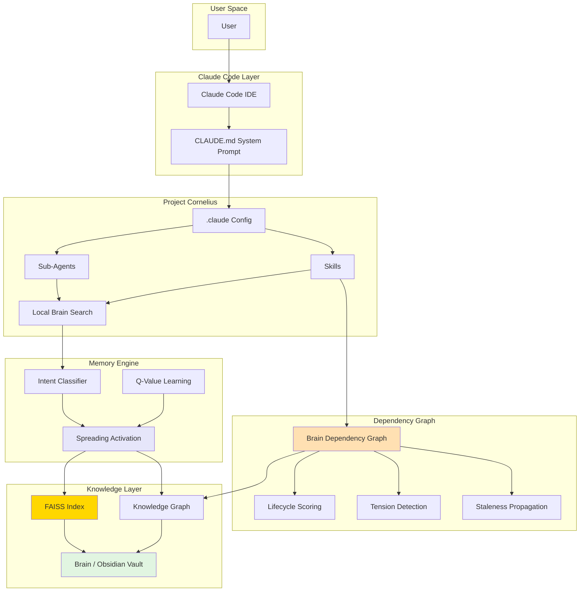

# Project Cornelius

**AI-powered second brain template for Claude Code + Obsidian**

Capture insights, discover connections, and synthesize knowledge - with AI assistance.

> 🌱 **Ships pre-seeded.** This isn't an empty template - it comes with a working knowledge graph of **~1,000 interlinked notes** on decision-making, judgment, and cognitive science (distilled from published research and books, ~5,000 edges). Clone it and `/advise`, `/recall`, or `/find-connections` work immediately. Start at [`Brain/03-MOCs/MOC - Knowledge Base.md`](Brain/03-MOCs/MOC%20-%20Knowledge%20Base.md), then layer your own thinking on top. See [knowledge-base-analysis.md](knowledge-base-analysis.md) for what's inside.

## What's New in v06.26

- **Seeded public knowledge base (1,031 notes)** - The template now ships with a real, fully-indexed library instead of a few showcase notes: 1,031 decision-science notes distilled from 57 research sessions and 6 books, spanning decision-making, judgment, behavioral economics, and the cognitive science beneath good decisions
- **11 new Maps of Content** - Topic-level navigation across decision-making, cognitive biases, risk and antifragility, neuroscience, consciousness, learning and memory, motivation, social cognition, embodied cognition, and meaning and wisdom
- **Portable prebuilt index** - The FAISS + graph index was rebuilt over the new corpus with vault-relative paths, so semantic search, recall, and connection discovery work on any clone immediately - no indexing required before you start exploring
- **Neutral, provenance-tagged notes** - External research distilled into atomic notes (provenance: encountered), navigated via the MOCs; only the foundation tier is published (agent-research and private tiers withheld)

<details>
<summary>v05.26 changes</summary>

- **Incubation loop** - Autonomous iterative thinking engine; each run applies a rotating analytical move (ACH, Bayesian update, steelman, cross-domain bridge, implication check) and persists reasoning state across scheduled runs
- **Domain watch** - Autonomous perception layer that scans the KB for new notes matching configured domains, checks gap resonance, and probes external signals to auto-activate topics for the incubation loop
- **Insight interview** - KB-grounded Socratic dialogue; searches existing notes on a topic then runs a one-question-at-a-time session to surface and sharpen your thinking, saving results as permanent notes
- **YouTube transcript** - Extract transcripts from any YouTube video for processing into the knowledge base
- **deep-research Phase 4** - Optional insight interview step before connection discovery, capturing your personal angles alongside extracted research
- **45 skills** for insight capture, autonomous thinking, connection discovery, research, and content creation
</details>

<details>
<summary>v04.26 changes</summary>

- **Brain Dependency Graph (BDG)** - Directed, mode-aware dependency graph layered on Local Brain Search. Seven semantic layers (signal -> synthesis), staleness propagation, lifecycle tracking, and tension detection
- **Staleness propagation** - `/propagate-change` traces which downstream notes need review when a framework changes
- **Lifecycle scoring** - `/compute-lifecycle` detects reflective -> crystallizing -> generative transitions
- **Tension detection** - `/detect-tensions` finds productive contradictions (high similarity + opposing conclusions)
- **Coherence sweeps** - `/coherence-sweep` runs full structural health analysis with staleness and lifecycle reports
- **Brain merge** - `/brain-merge` compares and selectively merges Brain directories across agent instances
- **Explanatory images** - `/create-explanatory-image` generates AI diagrams via Nano Banana (Gemini 2.5 Flash)
- **LBS daemon** - Background search daemon for persistent vector search
- **36 skills** for insight capture, connection discovery, research, and content creation
- **10 specialized sub-agents** for different knowledge tasks
</details>

<details>
<summary>v03.26 changes</summary>

- **SYNAPSE-inspired memory** - Spreading activation search with intent classification and usage-based learning
- **Dialectic engine** - Two sub-agents argue committed positions while orchestrator synthesizes
- **Autonomous research** - `/learn-new-things` runs full research cycles with git branching
- **Insight graduation** - `/graduate-insights` promotes draft notes to permanent status with Zettelkasten criteria
- **Q-value learning** - Search rankings improve over time based on actual usage patterns
- **Trinity-compatible** - Can be deployed to the Trinity agent orchestration platform
</details>

---

## TL;DR

**Project Cornelius** = Claude Code + Custom Agents + Obsidian + FAISS Vector Search

It's like having a highly specialized AI research assistant that:
- **Finds hidden connections** in your notes you didn't know existed
- **Writes articles** from your accumulated insights
- **Captures unique thoughts** while preserving your voice
- **Discovers patterns** across different domains of knowledge
- **Learns from you** - search rankings improve based on your actual usage
- **Researches autonomously** - can run research cycles and expand your knowledge base
- **Thinks while you sleep** - runs scheduled reasoning loops on open questions via [Trinity](https://github.com/Abilityai/trinity)
- **Evolves with you** through Git-tracked configurations

---

## What is Project Cornelius?

Project Cornelius is a **multi-layered knowledge management system** that creates an intelligent bridge between your thinking and AI assistance. It's an agent-within-an-agent architecture that transforms Claude Code into a specialized second brain operator.

### The Layer Cake Architecture

```
┌─────────────────────────────────────────┐
│         Human (You)                     │
├─────────────────────────────────────────┤
│         Claude Code                     │ ← General AI assistant
├─────────────────────────────────────────┤
│     Project Cornelius Agent             │ ← Specialized for knowledge work
│     (Defined by CLAUDE.md)              │
├─────────────────────────────────────────┤
│     Specialized Sub-Agents              │ ← Task-specific capabilities
│  (vault-manager, connection-finder...)  │
├─────────────────────────────────────────┤
│  Brain Dependency Graph (BDG)           │ ← Directed graph with staleness,
│  (7 semantic layers, lifecycle)         │   lifecycle, and tension tracking
├─────────────────────────────────────────┤
│     Local Brain Search (FAISS)          │ ← Vector search + memory engine
├─────────────────────────────────────────┤
│         Your Knowledge Base             │ ← Your actual "brain"
│        (Obsidian Vault/Brain)           │
└─────────────────────────────────────────┘
```

### Key Features

**Insight Capture**
- Extract unique insights from books, articles, and conversations
- Preserve your authentic voice and reasoning patterns
- Distinguish between your original thinking and borrowed ideas

**Connection Discovery**
- Find non-obvious relationships between notes
- Identify consilience zones where multiple domains converge
- Surface cross-domain bridges and synthesis opportunities

**Content Generation**
- Synthesize notes into articles and frameworks
- Generate talking points and outlines
- Create content from your accumulated knowledge

**SYNAPSE-Inspired Memory Search**
- FAISS-powered semantic search (fast, local, no API calls)
- Intent-aware query classification (factual/conceptual/synthesis/temporal)
- Spreading activation with lateral inhibition
- Usage-based Q-value learning - rankings improve with use
- Graph analytics: hubs, bridges, centrality
- Explicit (wiki-links) and semantic edge distinction

---

## Quick Start

```bash
# 1. Clone this repository
git clone https://github.com/Abilityai/cornelius.git
cd cornelius

# 2. Configure your vault path
cp .claude/settings.md.template .claude/settings.md
# Edit .claude/settings.md and set your vault path:
# VAULT_BASE_PATH=./Brain  (or absolute path to your vault)

# 3. Set up Local Brain Search
cd resources/local-brain-search
python -m venv venv
source venv/bin/activate  # or venv\Scripts\activate on Windows
pip install -r requirements.txt

# 4. Index your vault
./run_index.sh

# 5. Start Claude Code
cd ../..
claude
```

**Detailed guides:**
- [QUICKSTART.md](QUICKSTART.md) - 5-minute setup
- [INSTALL.md](INSTALL.md) - Detailed installation
- [MCP-SETUP.md](MCP-SETUP.md) - MCP server configuration (optional)

---

## Recommended: Deploy to Trinity for Autonomous Operation

Running locally is fine for development. For persistent autonomous operation - scheduled research, incubation loops, domain watching, and agent collaboration - deploy Cornelius to **[Trinity](https://github.com/Abilityai/trinity)**.

Trinity is an open-source platform for self-hosting autonomous agent fleets. Each agent runs in an isolated Docker container with cron scheduling, real-time monitoring, and agent-to-agent delegation.

On Trinity, Cornelius also gets the **Brain Orb** - a live 3D visualization of this knowledge base on the agent's Brain tab, with scope mounting (per-book sub-scopes included), voice-drivable KB search, and capture/link/refresh actions that write back into the vault. The seeded KB renders out of the box (`data.seed.json`); the hook contract ships in `.trinity/brain-orb/` (requires a Trinity base image from 2026-07 or later, with the platform's Brain Orb flags enabled).

**Fastest path:** Use the `trinity` plugin from the [Abilities marketplace](https://github.com/Abilityai/abilities):

```bash
# Install the plugin
claude plugin add abilityai/abilities

# Then from inside Cornelius:
/trinity:connect    # one-time auth
/trinity:onboard    # deploy
```

**Documentation:** [docs.example.com](https://docs.example.com)

### Abilities Plugin Marketplace

The [Abilities marketplace](https://github.com/Abilityai/abilities) provides Claude Code plugins for the full agent lifecycle:

| Plugin | What it does |
|--------|-------------|
| `create-agent` | Scaffold new agents from domain-specific wizards |
| `agent-dev` | Extend agents with skills, memory systems, and backlogs |
| `trinity` | Deploy and sync agents to Trinity |
| `dev-methodology` | Documentation-driven development framework |
| `utilities` | Ops tools - incident investigation, deployment rollback |

Install all at once: `/plugin marketplace add abilityai/abilities`
Docs: [docs.example.com/cloud-code-plugins](https://docs.example.com/cloud-code-plugins)

---

## What's Included

### Sub-Agents (`.claude/agents/`)

| Agent | Purpose |
|-------|---------|
| `vault-manager` | Create, read, update, delete notes with proper metadata |
| `connection-finder` | Find hidden relationships between notes (user-directed) |
| `auto-discovery` | Autonomous cross-domain connection hunter |
| `insight-extractor` | Extract insights from YOUR content (conversations, transcripts) |
| `document-insight-extractor` | Extract insights from EXTERNAL content (papers, books) |
| `thinking-partner` | Brainstorming and ideation support |
| `diagram-generator` | Create Mermaid visualizations |
| `local-brain-search` | FAISS-powered semantic search and graph analytics |
| `research-specialist` | Deep research with web search |
| `epub-chapter-extractor` | Extract content from ebooks |

### Skills (`.claude/skills/`)

**Search & Discovery**

| Skill | Command | Purpose |
|-------|---------|---------|
| `recall` | `/recall <topic>` | 3-layer semantic search with spreading activation |
| `search-vault` | `/search-vault <query>` | Quick semantic + keyword search |
| `find-connections` | `/find-connections <note>` | Map conceptual network |
| `auto-discovery` | `/auto-discovery` | Run cross-domain connection discovery |
| `detect-tensions` | `/detect-tensions` | Find productive contradictions between notes |

**Insight Management**

| Skill | Command | Purpose |
|-------|---------|---------|
| `extract-insights` | `/extract-insights <file>` | Extract insights from YOUR content |
| `extract-document-insights` | `/extract-document-insights <file>` | Extract insights from external documents |
| `graduate-insights` | `/graduate-insights` | Promote notes to permanent status |
| `integrate-recent-notes` | `/integrate-recent-notes` | Connect recent notes to knowledge base |
| `insight-interview` | `/insight-interview <topic>` | KB-grounded Socratic dialogue to surface and sharpen your thinking |

**Content & Synthesis**

| Skill | Command | Purpose |
|-------|---------|---------|
| `create-article` | `/create-article <topic>` | Write article from notes |
| `get-perspective-on` | `/get-perspective-on <topic>` | Extract unique perspective |
| `synthesize-insights` | `/synthesize-insights` | Combine insights into narrative |
| `dialectic` | `/dialectic <question>` | Stress-test ideas with opposing positions |
| `create-explanatory-image` | `/create-explanatory-image` | Generate AI diagrams via Nano Banana |

**Research & Learning**

| Skill | Command | Purpose |
|-------|---------|---------|
| `deep-research` | `/deep-research <topic>` | Autonomous research pipeline |
| `learn-new-things` | `/learn-new-things [topic]` | Full research cycle with git branching |
| `get-youtube-transcript` | `/get-youtube-transcript <url>` | Extract transcript from YouTube video |

**System & Maintenance**

| Skill | Command | Purpose |
|-------|---------|---------|
| `analyze-kb` | `/analyze-kb` | Generate structure report |
| `refresh-index` | `/refresh-index` | Rebuild FAISS index |
| `self-diagnostic` | `/self-diagnostic` | Health check |
| `git-commit-push` | `/git-commit-push` | Stage, commit, push with approval gate |
| `talk` | `/talk` | Conversational partner mode |
| `update-changelog` | `/update-changelog` | Update master CHANGELOG.md |
| `benchmark-memory` | `/benchmark-memory` | Benchmark search system |
| `test-memory-system` | `/test-memory-system` | Test memory improvements |
| `scheduled-run` | `/scheduled-run <skill>` | Wrapper for cron automation |
| `update-dashboard` | `/update-dashboard` | Update Trinity dashboard metrics |

**Autonomous Thinking**

| Skill | Command | Purpose |
|-------|---------|---------|
| `incubation-loop` | `/incubation-loop` | Iterative thinking engine - applies rotating analytical moves to active topics |
| `manage-thinking-topics` | `/manage-thinking-topics` | Seed, review, crystallize, and retire thinking loop topics |
| `domain-watch` | `/domain-watch` | Autonomous KB scanning - detects new signals and activates thinking topics |
| `manage-watching-domains` | `/manage-watching-domains` | Configure domain-watch surveillance and review proposals |

**Brain Dependency Graph**

| Skill | Command | Purpose |
|-------|---------|---------|
| `coherence-sweep` | `/coherence-sweep` | Full BDG health analysis - staleness, lifecycle, structure |
| `propagate-change` | `/propagate-change <note>` | Trace which notes need review after a change |
| `compute-lifecycle` | `/compute-lifecycle` | Detect reflective -> crystallizing -> generative transitions |
| `detect-tensions` | `/detect-tensions` | Find productive contradictions for synthesis |
| `brain-merge` | `/brain-merge` | Compare and merge Brain directories across instances |

### Sample Vault (`Brain/`)

Complete Zettelkasten structure with templates:

```
Brain/
├── 00-Inbox/              # Quick capture, unprocessed notes
├── 01-Sources/            # Literature notes, references
├── 02-Permanent/          # Atomic, evergreen notes (CORE)
├── 03-MOCs/               # Maps of Content
├── 04-Output/             # Articles, frameworks, insights
│   └── Articles/          # Each article in own folder
├── 05-Meta/               # System notes, changelogs
├── AI Extracted Notes/    # AI-extracted from YOUR content
└── Document Insights/     # AI-extracted from external content
```

### Local Brain Search (`resources/local-brain-search/`)

FAISS-powered vector search with SYNAPSE-inspired memory architecture:

```bash
# Semantic search (static mode - fast)
./run_search.sh "dopamine motivation" --limit 10 --json

# Spreading activation search (better for synthesis queries)
./run_search.sh "how does dopamine relate to decision making" --mode spreading --json

# Find connections
./run_connections.sh "Note Name" --json

# Graph analytics
./run_connections.sh --hubs --json    # Most connected notes
./run_connections.sh --bridges --json  # Cross-domain connectors
./run_connections.sh --stats --json    # Graph statistics

# Learning system status
./run_learning.sh status              # Q-value stats
./run_learning.sh top                 # Top notes by learned relevance

# Re-index after changes
./run_index.sh
```

**Memory Architecture:**
- **Intent Classification** - Routes queries as factual/conceptual/synthesis/temporal
- **Spreading Activation** - Propagates relevance through graph with lateral inhibition
- **Usage-Based Learning** - Q-values adjust rankings based on what you actually use
- **Configuration** - Single source of truth in `memory_config.py`

### Brain Dependency Graph (`resources/brain-graph/`)

A directed, mode-aware dependency graph layered on top of Local Brain Search. Every relationship has **direction** (who's authoritative), **mode** (generative vs reflective), and **type** (derives-from, instantiates, references, associates, tension, supersedes).

**Seven Semantic Layers:** signal (1) -> impression (2) -> insight (3) -> framework (4) -> lens (5) -> synthesis (6) -> index (7)

```bash
# Bootstrap the graph from your vault
./run_brain_graph.sh bootstrap

# Check graph status
./run_brain_graph.sh status --json

# Inspect a specific note's dependencies
./run_brain_graph.sh inspect "Note Name" --json

# Propagate staleness from a changed note
./run_brain_graph.sh propagate "Note Name" --json

# Compute lifecycle scores (reflective -> crystallizing -> generative)
./run_brain_graph.sh lifecycle --json

# Find productive contradictions
./run_brain_graph.sh tensions --json

# Full coherence report
./run_brain_graph.sh coherence --days 7 --tensions --json
```

**Key Behaviors:**
- When a framework note changes, staleness propagates downstream with attenuation
- Notes transition from reflective -> crystallizing -> generative based on citation patterns
- Productive contradictions (tension edges) are immune to staleness - surfaced as synthesis opportunities
- Authority is edge-local, not node-global

**Architecture details:** See `resources/brain-graph/BRAIN-DEPENDENCY-GRAPH-ARCHITECTURE.md`

---

## Documentation

| File | Purpose |
|------|---------|
| [QUICKSTART.md](QUICKSTART.md) | 5-minute setup |
| [INSTALL.md](INSTALL.md) | Detailed installation & troubleshooting |
| [EXAMPLES.md](EXAMPLES.md) | Sample notes, MOCs, workflows |
| [FOLDER-STRUCTURE.md](FOLDER-STRUCTURE.md) | Vault organization guide |
| [MCP-SETUP.md](MCP-SETUP.md) | MCP server configuration |
| [Brain/README.md](Brain/README.md) | Sample vault guide |

---

## Use Cases

**Capture**: Extract insights from books and articles while reading
**Connect**: Find non-obvious relationships between ideas from different domains
**Create**: Synthesize notes into articles, frameworks, and presentations
**Discover**: Let AI find patterns you didn't know existed
**Research**: Autonomous research cycles that expand your knowledge base
**Evolve**: Track how your thinking changes over time

---

## Core Principles

**Atomic notes** - One idea per note, well-linked
**Your words** - Not copy-paste from sources
**Rich links** - Connect everything with `[[wiki-links]]`
**Regular discovery** - Run connection finder and auto-discovery
**Active synthesis** - Create content from your connections

---

## Requirements

- [Claude Code](https://claude.ai/claude-code) (CLI)
- [Obsidian](https://obsidian.md/) (for viewing/editing vault)
- Python 3.10+ (for Local Brain Search)
- Node.js 18+ (optional, for MCP servers)

---

## Architecture Overview



---

## Version History

| Version | Changes |
|---------|---------|
| v06.26 | Seeded public knowledge base (1,031 decision-science notes + 11 MOCs), portable rebuilt index |
| v05.26 | Incubation loop, domain watch, insight interview, YouTube transcript, deep-research Phase 4, 45 skills |
| v04.26 | Brain Dependency Graph, staleness propagation, lifecycle scoring, tension detection, coherence sweeps, brain merge, explanatory images, LBS daemon, 36 skills |
| v03.26 | SYNAPSE memory, dialectic engine, autonomous research, insight graduation, 30 skills |
| v02.25 | Skills architecture, FAISS search, remove Smart Connections |
| v01.25 | Initial release with commands, Smart Connections, basic search |

---

## License

MIT - Use, modify, distribute freely. See [LICENSE](LICENSE).

---

## Contributing

Contributions welcome! Please read the existing code style and structure before submitting PRs.

---

**Questions?** Check the docs above or start with [QUICKSTART.md](QUICKSTART.md)
